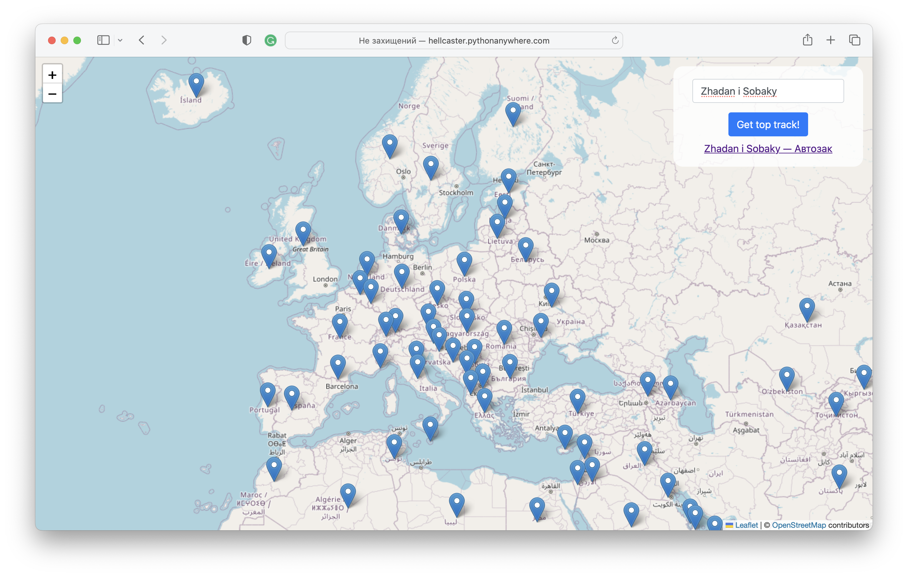

# Spotify Map

## About project

This project detects top track of artist and shows in map where that track is available. This is really tricky and easy way to get top tracks.

## Result example

You can try web site here [hellcaster.pythonanywhere.com](https://hellcaster.pythonanywhere.com/)



## Installation and start

To start project do following commands:

### Install requirements

1. Clone the repository and open folder in terminal.
2. Create virtual enviroment and install requirements:

```cmd
python3 -m venv venv

source venv/bin/activate # if you are using MacOS
venv/bin/activate # for Windows

pip3 install requirements.txt
```

### Start project

```cmd
python3 main.py
```

You will see in which port application will start in terminal.

**IMPORTANT:** you will also need a Spotify Secret code and key. Get it in [developer.spotify.com](https://developer.spotify.com).

### Determinate

```cmd
deactivate
```

## Contributing

Pull requests are welcome. For major changes, please open an issue first
to discuss what you would like to change.

Please make sure to update tests as appropriate.

## License

[MIT](https://choosealicense.com/licenses/mit/)